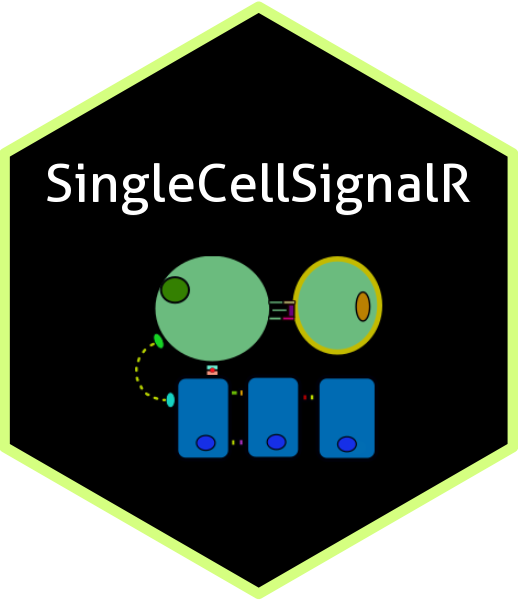

# SingleCellSignalR `Version 2` 
  

<!-- badges: start -->


<!-- badges: end -->

  
## Overview

**SingleCellSignalR** infer ligand-receptor (L-R) interactions from single cells
experiments.  
  
**Version 2** of the library introduces an important change: we have integrated
**SignleCellSignalR** with its sister Bioconductor library
[BulkSignalR](https://www.bioconductor.org/packages/release/bioc/html/BulkSignalR.html).
This has required several changes starting with a design based on S4 object,
but also and very importantly generic mechanisms to update and download
reference databases, and to deal with non *Homo sapiens* species. Previously,
only *Mus musculus* was available and the reference databases were distributed
alongside the library.

Moreover, integration with `BulkSignalR` was also
the opportunity to propose a **new L-R interaction scoring** including target
genes in pathways downstream the receptor. This new scoring is based on the
`BullkSignalR` statistical model used in *differential analysis* mode. It
provides a complementary perspective to `SingleCellSignalR` original
scoring named **LR-score**. The latter was limited to the ligand and the
receptor expression, while the differential score from `BulkSignalR` rather
reflects an increase of activity. If many related cell populations are
considered, for instance immune cells, then the differential score might miss
recurrent though important L-R interactions. The LR-score would not suffer
from recurrence. Conversely, to consider target genes below the receptor
and to focus on contrasts between cell populations is also highly
relevant in many contexts. Hence the interest of the scoring inherited from
`BulkSignalR`. Lastly, we show in the application examples that flexibility of
the new S4 design even enables users to implement an expression score
based on the LR-score that includes target gene expression on
top of the ligand and the receptor expressions.

That is, `SingleCellSignalR` Version 2 offers a lot of
flexibility to adapt to the specifics of the data at hand. Moreover, this
new version gives access to the many graphical functions provided with
`BulkSignalR`. A **preprint** of our paper describing the new version
of `SingleCellSignalR` is available [here](https://www.biorxiv.org/cgi/content/short/2025.10.05.680519v1).

Technically, `SingleCellSignalR` Version 2 can be regarded as a
wrapper to `BulkSignalR`  differential analysis classes. `BulkSignalR`
contains most of the code complexity and serves as a basic layer to
develop specific applications such as single-cell analyses.

&nbsp;

## Installation

``` R 
# Installation can go via GitHub:
# install.packages("devtools")
devtools::install_github("ZheFrench/BulkSignalR",build_vignettes = TRUE)
devtools::install_github("ZheFrench/SingleCellSignalR",build_vignettes = TRUE)

# or directly from Bioconductor
if (!require("BiocManager", quietly = TRUE))
    install.packages("BiocManager")
BiocManager::install("SingleCellSignalR")

# To read the vignette
# browseVignettes("SingleCellSignalR")
```

&nbsp;

## Notes

For a version history/change logs, see the [NEWS file](https://github.com/ZheFrench/SingleCellSignalR/blob/master/NEWS).


Version 1 of SingleCellSignalR (original version as published in NAR in 2020), is still available
from a branch of this repository names version_1.


**SingleCellSignalR** has been successfully installed on Mac OS X, Linux, and Windows using R version 4.5.


The code in this repository is published with the [CeCILL](https://github.com/ZheFrench/SingleCellSignalR/blob/master/LICENSE.md) License.


<!-- badges: start -->
[](https://shields.io/)
<!-- badges: end -->