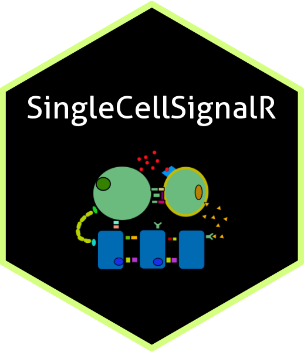

 1 
 2 # SingleCellSignalR 
 3
 4 <!-- badges: start -->
 5 
 6 
 7 <!-- badges: end -->
 8
 9 # Test
10 
11 # ReadMe
12 This repository is linked to Bioconductor. You can download and install **SingleCellSignalR** directly form there: https://bioconductor.org/packages/rele$
13

